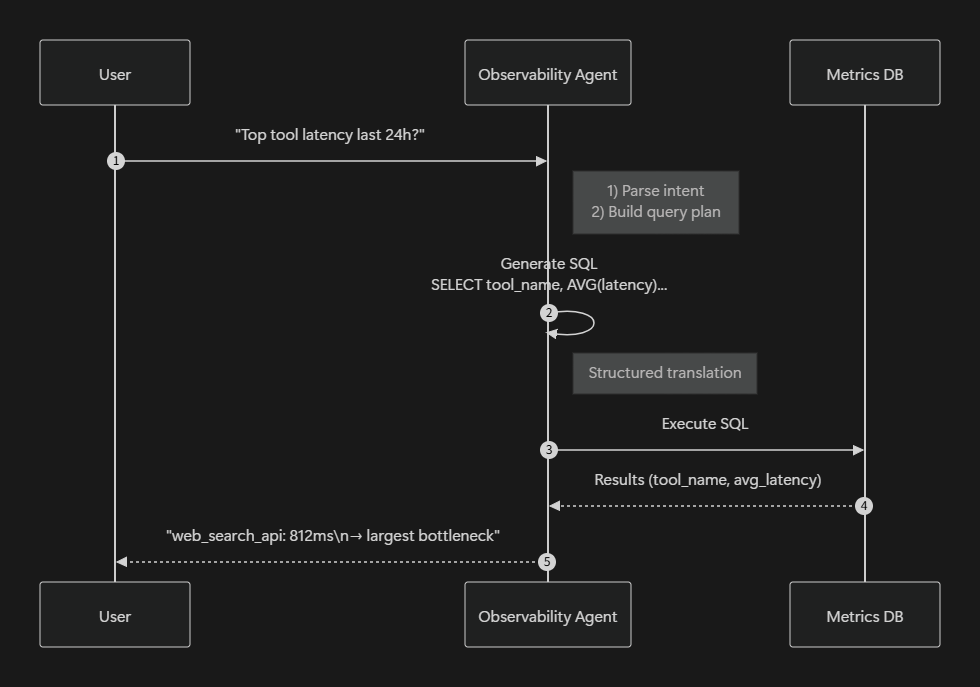

✅ User-Centric Technical Use Case (Short Version)

A support-platform engineer wants to understand why their LLM agent’s responses have become slow. Instead of digging through raw traces, they ask the Observability Agent:

“Which tool calls had the highest latency in the last 24 hours?”

The system:

Parses the request into a structured intent

{"metric": "avg_latency", "entity": "tool", "time_window": "24h"}

Generates SQL

SELECT tool_name, AVG(tool_latency_ms)
FROM steps
WHERE is_tool_call=1 AND end_time>=DATETIME('now','-24h')
GROUP BY tool_name
ORDER BY AVG(tool_latency_ms) DESC;

Executes + cleans results, handling missing values and failed calls automatically.

Returns a clear insight

web_search_api: 812 ms
order_database_api: 448 ms
inventory_checker: 292 ms

Agent: “The main bottleneck is web_search_api.”

🎬 Three-Shot Demo (Poster-Ready)

1. User asks:

“Top tool latency last 24h?”

2. System translates:

SELECT tool_name, AVG(tool_latency_ms) ...

3. System answers:

web_search_api: 812 ms
→ Biggest source of delay

